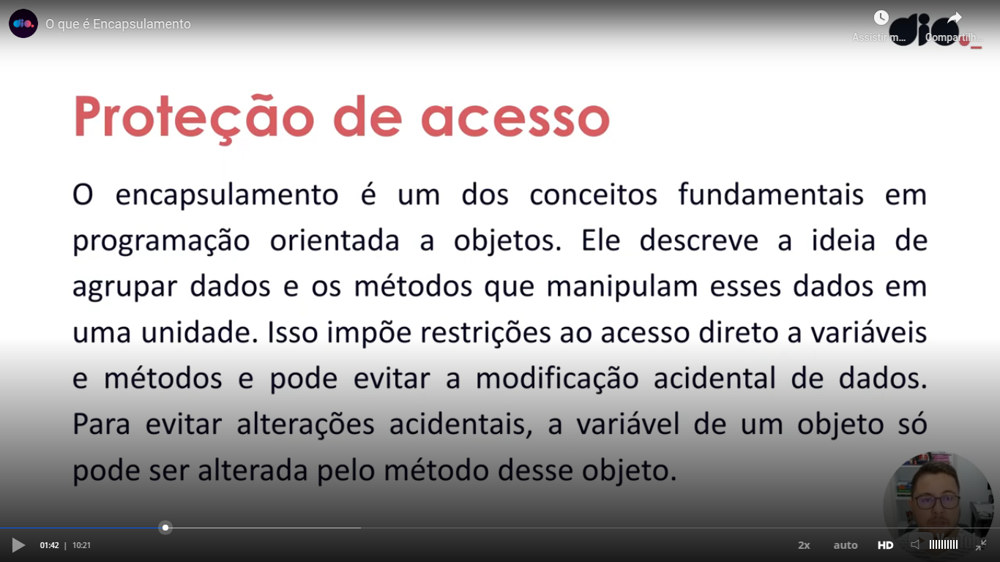

# General

Definition of encapsulation:



Teacher enforced that there is a convention to not access private or protected methods, not a keyword to make the enforcement. I [talked to ChatGPT](https://chatgpt.com/c/67b20ee4-f844-8007-ba73-b8d23f97b725) to explore more the question.

Please see this test:

```python
class Account:
    def __init__(self, initial_balance=0):
        self.__balance = initial_balance  # Private attribute
        self.__batata = 1
        self._cebola = 1
    
    @property
    def balance(self):
        return self.__balance
    
    def deposit(self, value):
        if value > 0:
            self.__balance += value
            return True
        return False
    
    def withdraw(self, value):
        if 0 < value <= self.__balance:
            self.__balance -= value
            return True
        return False

# Example usage:
account = Account(100)
account.deposit(50)
print(account.balance)  # 150
account.withdraw(30)
print(account.balance)  # 120
# print(account.__batata) 2 underlines => error
print(account._cebola) # 1 underline => ok
```